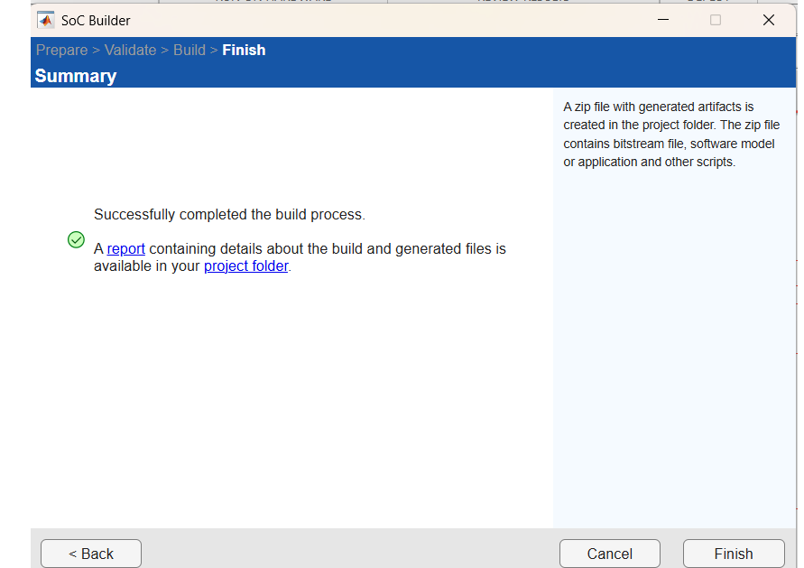
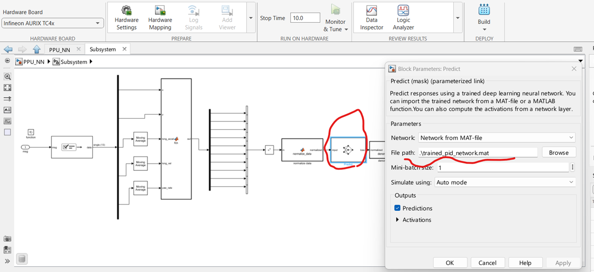

# AI_PID_Trajectory_Control


## Overview

This project is a multicore embedded trajectory control demo targeting the **Infineon AURIX&trade; TC4x** microcontroller family. It is built with MATLAB/Simulink and uses Simulink SoC Builder for multicore code generation and deployment.

The system implements a vehicle trajectory controller that:
- Receives vehicle state and reference path data over **UDP/Ethernet**
- Conventional **PID controller** computes a **steering angle**
- It uses a **Neural Network (PPU_NN model)** to adapt PID gains during execution
- It runs across two cores (TriCore0 and PPU) with inter-process communication channels

## Project architecture

```
TopModel.slx
├── TC_C0_ETH_PID   — TriCore0: Ethernet receive, cross-track error PID (steering angle output)
└── PPU_NN          — PPU core: Neural network inference for adaptive PID gain computation
```

Inter-core communication is handled via **Interprocess Data Channels** (SoCData). A `Task Manager` block on each core manages scheduling via heartbeat and event signals.

## Repository structure

| Path | Description |
|------|-------------|
| `TopModel.slx` | Top-level SoC model (entry point) |
| `HSP_Multicore.prj` | MATLAB project file - open this first |
| `components/` | Sub-models: `TC_C0_ETH_PID.slx`, `PPU_NN.slx` |
| `LanLib/` | Ethernet/LWIP library (AurixNetLib, UDP setup, PHY driver) |
| `TomLib/` | Utility blocks (printf, ISR, C-call S-functions) |
| `PPU/` | Generated code for PPU core |
| `TriCore/` | Generated code for TriCore0 |
| `Reset/` | Reset sequence sources (`SmmReset.c/h`) |
| `PPU_values.m` | PPU controller tuning parameters |
| `codeg_folderstruct.m` | Code generation folder structure configuration script |
| `trained_pid_network.mat` | Trained neural network weights for PID gain scheduling |

## Requirements

- MATLAB® **R2026a** or later (project generated with R2026a)
- Simulink®
- Simulink Coder / Embedded Coder
- **SoC Blockset** (for multicore targeting and SoC Builder)
- Infineon AURIX&trade; TC499 STD TriBoard

## Getting started

### 1. Open the project

Double-click **`HSP_Multicore.prj`** to open the MATLAB project. This sets up all paths and configurations automatically.

### 2. Generate and compile code

Open **`TopModel.slx`**, then navigate to:

**HARDWARE tab → DEPLOYMENT → Configure & Build**

As shown below:


This launches **SoC Builder**, which generates C code for both cores, compiles it, and (optionally) deploys it to the target.

As code generated and compiled successfully, SoC Builder window should look like as in the picture below.



> **Note:** In some environments, the **Predict** block may fail to locate the `trained_pid_network.mat` file even though a relative path is configured by default. If this issue occurs, open the **PPU_NN** model as the top-level model, select the **Predict** block, and manually specify the absolute path to `trained_pid_network.mat`, as shown in the figure below.



## Communication interface (UDP)

The controller exchanges data over UDP. Packet layout:

### Input (20 × float32 = 80 bytes)

| # | Signal |
|---|--------|
| 1 | Cross-track error |
| 2–6 | Reference path — X coordinates (5 points) |
| 7–11 | Reference path — Y coordinates (5 points) |
| 12 | Longitudinal acceleration |
| 13 | Longitudinal velocity |
| 14 | Yaw rate |
| 15 | External P gain |
| 16 | External I gain |
| 17 | External D gain |
| 18 | Enable PPU gains flag |
| 19 | Enable PWM flag |
| 20 | AURIX&trade; reset flag |

### Output (4 × float32 = 16 bytes)

| # | Signal |
|---|--------|
| 1 | PID steering angle |
| 2 | PPU P gain |
| 3 | PPU I gain |
| 4 | PPU D gain |

## Neural network (PPU_NN)

The PPU core runs a trained feed-forward neural network (`trained_pid_network.mat`) that predicts adaptive PID gains based on path curvature and vehicle state. The network can be enabled or disabled at runtime via the **Enable PPU Gains** flag in the input packet.

Executing the neural network on the PPU offloads the computational workload from the main MCU, reducing CPU utilization and freeing resources for other real-time control tasks. Furthermore, the PPU is optimized for parallel data processing, enabling efficient and low-latency neural network inference with deterministic execution timing. This allows adaptive PID gains to be computed in real time while maintaining the responsiveness and overall performance of the control system.

## Ethernet / LWIP Stack

The `LanLib/` directory contains a port of the **lwIP** TCP/IP stack configured for AURIX&trade;, including:
- `AurixNetLib.c/h` — AURIX-specific network abstraction
- `UDP_Setup_LWIP.c/h` — UDP socket configuration
- `myHsphy.c/h` — Ethernet PHY driver
- `lwipopts.h` — lwIP compile-time configuration
- Board support for **TC499A TriBoard** (COM V10 and STD V11 variants)

## Notes

- The `slprj/` and `PPU/`, `TriCore/` folders contain build artefacts and are not meant to be edited manually.
- The `.slxc` files are Simulink model cache files generated automatically.
- `soc_prj/` contains the SoC Builder project outputs (`TopModel_sw_PPU.slx`, `TopModel_sw_TriCore0.slx`).
