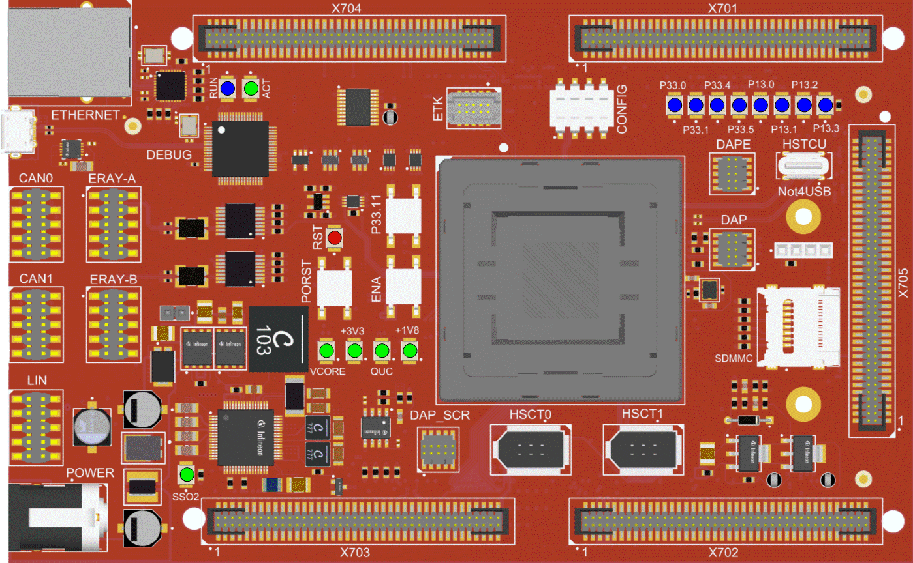
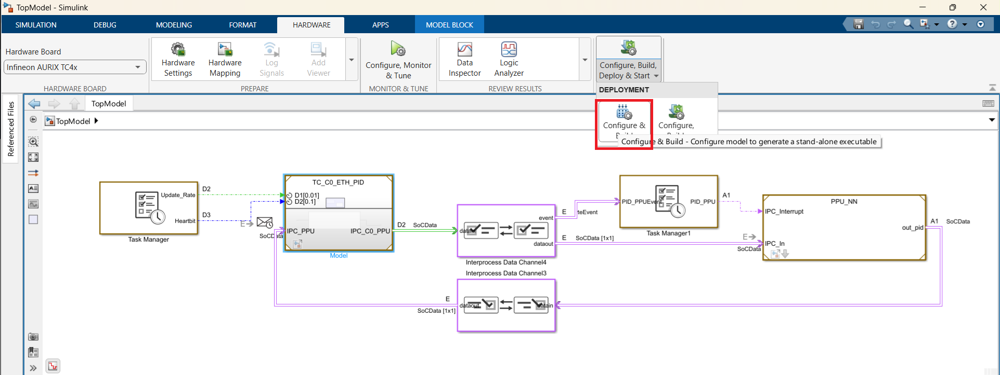

 

# HSP_ TC499_Demo_AI_PID_Trajectory_Control


This repository demonstrates an end-to-end trajectory control workflow for an autonomous vehicle.

## Device

The device used in this example is AURIX&trade; TC499XE_AA-Step_CC_STD.

## Board

The board used for testing is the AURIX&trade; TC499XE_AA-Step_CC_STD (KIT_TC499_STD_TRB).

 

## Scope of work

This project demonstrates a closed-loop trajectory control system combining a RoadRunner and Simscape Multibody vehicle simulation with an AI-enhanced PID controller running on an Infineon AURIX&trade; TC4x microcontroller.

The simulation project validates the controller in a realistic virtual environment. The embedded project deploys the controller to the AURIX&trade; microcontroller using Simulink SoC Builder. The simulation and controller communicate over UDP/Ethernet using a shared packet interface described [below](#udp-communication-interface).

## Introduction

The system is divided into two complementary projects:

- `ROADRUNNER_SIMULATION/` provides the physics-based closed-loop simulation using RoadRunner and Simscape Multibody.
- `AI_PID_Trajectory_Control/` contains the multicore embedded controller and its code-generation project for the Infineon AURIX&trade; TC4x.

RoadRunner provides the scene, scenario, and prescribed trajectory. Simscape Multibody models the vehicle physics and sends the vehicle state to the controller. The controller calculates a steering command and returns it to the simulation so that the vehicle can follow the reference trajectory.

The embedded controller uses two processing units:

- **TriCore0** receives vehicle state, prescribed trajectory, cross-track error over Ethernet, executes the trajectory controller calculating the steering angle.
- **PPU** runs a trained neural network that provides adaptive PID (trajectory controller) gains based on the vehicle state and path curvature.

## Implementation

### Repository structure

```
HSP_TC499_Demo_AI_PID_Trajectory_Control/
│    ROADRUNNER_SIMULATION/                     # RoadRunner and vehicle simulation
│    ├── data/                                  # Simulation data and parameters
│    │   ├── aurix/                             # UDP interface headers
│    │   ├── controller/                        # Pre-recorded data and trained networks
│    │   ├── images/                            # Documentation screenshots
│    │   └── tires/                             # Tire parameter files (.tir)
│    ├── graveyard/
│    ├── models/                                # Simulink / Simscape models (.slx)
│    ├── resources/
│    │   ├── project/
│    ├── roadRunner/                            # RoadRunner scene and scenario assets
│    ├── scripts/                               # MATLAB scripts for simulation and analysis
│    ├── RoadRunner.prj                         # Project file use this first
│    └── README.md                              # Project specific README file
│
└── AI_PID_Trajectory_Control/                  # Embedded code generation project
│    ├── HSP_Multicore.prj                      # MATLAB project file – open this first
│    ├── TopModel.slx                           # Top-level SoC model (entry point)
│    ├── README.md                              # Project specific README file
│    ├── components/                            # Sub-models: TC_C0_ETH_PID.slx, PPU_NN.slx
│    ├── LanLib/                                # Ethernet / lwIP library for AURIX&trade;
│    ├── TomLib/                                # Utility S-function blocks#
│    ├── Reset/                                 # Reset functions
│    ├── resources/                             # Project specific files
│    ├── imgs/                                  # Directory containing images used in README
│    ├── PPU_values.m                           # Controller tuning parameters
│    └── trained_pid_network.mat                # Trained neural network
└──  README.md                                  # Top level README giving a general overview about project 

```

### Simulation project (`ROADRUNNER_SIMULATION`)

#### Required products

- MATLAB® R2026a or later
- Simulink®
- Simscape™
- Simscape™ Multibody™
- Automated Driving Toolbox™
- Roadrunner™

#### Installing RoadRunner

1. **Download**: RoadRunner from [MathWorks installation page](https://de.mathworks.com/help/roadrunner/ug/install-and-activate-roadrunner.html).
2. **Activate**: Run the installer and sign into your MathWorks account.

#### Running the simulation

1. Open `ROADRUNNER_SIMULATION/RoadRunner.prj` in MATLAB.
2. Run `simulateSimpleLoopScene` from the `scripts/` directory:

   ```matlab
   simulateSimpleLoopScene
   ```

The script opens RoadRunner, loads the scene, opens the Simscape model, and starts the co-simulation. The default scenario shows a vehicle driving through a roundabout.

#### Model architecture

The Simscape model in `ROADRUNNER_SIMULATION/models/simscapeMultibodyVehicle.slx` contains:

| Block | Role |
|---|---|
| **RoadRunner Reader**    | Reads the prescribed trajectory and desired speed from RoadRunner. |
| **Vehicle & Controller** | Simulates the vehicle and runs the AI-enhanced PID controller. |
| **RoadRunner Writer**    | Transforms the calculated vehicle pose back into the RoadRunner coordinate frame. |

**Note:** The Roadrunner Reader is currently implemented for the included scenario. If you modify the scenario or trajectory, you must update the Reader block accordingly.

### Embedded code-generation project (`AI_PID_Trajectory_Control`)

#### Required products

- MATLAB® R2026a or later
- Simulink®
- Simulink Coder / Embedded Coder
- SoC Blockset
- Infineon AURIX&trade; TC499 STD TriBoard

#### Controller architecture
| Processing unit | Model | Function |
|---|---|---|
| **TriCore0** | `TC_C0_ETH_PID.slx` | Receives vehicle state, prescribed trajectory, cross-track error over Ethernet, executes PID controller calculating the steering angle. |
| **PPU** | `PPU_NN.slx` | Runs neural-network inference and calculates adaptive PID gains. |

Data between the processing units is exchanged through **Interprocess Data Channels** provided by SoC Blockset.

#### Generating and compiling code

1. Open `AI_PID_Trajectory_Control/HSP_Multicore.prj` in MATLAB. The project configures the required paths automatically.
2. Open `AI_PID_Trajectory_Control/TopModel.slx`.
3. Select **HARDWARE > DEPLOYMENT > Configure & Build** to start SoC Builder.

SoC Builder generates and compiles code for both processing units and can optionally deploy the generated code to the target board.



#### Neural Network (PPU_NN)

The PPU runs the trained feed-forward network stored in `trained_pid_network.mat`. The network predicts adaptive PID gains from path curvature and vehicle state.

The PPU gains can be enabled or disabled at runtime through the `enable PPU gains flag` in the input UDP packet.

### UDP communication interface

The simulation and embedded projects use the same UDP packet layout.

#### Input packet - 20 x `float32` (80 bytes)

| Number | Signal |
|---:|---|
| 1 | Cross-track error |
| 2-6 | Reference path X coordinates, 5 points |
| 7-11 | Reference path Y coordinates, 5 points |
| 12 | Longitudinal acceleration |
| 13 | Longitudinal velocity |
| 14 | Yaw rate |
| 15 | External P gain |
| 16 | External I gain |
| 17 | External D gain |
| 18 | Enable PPU gains flag |
| 19 | Enable PWM flag |
| 20 | AURIX&trade; reset flag |

#### Output packet - 4 x `float32` (16 bytes)

| Number | Signal |
|---:|---|
| 1 | PID steering angle |
| 2 | PPU P gain |
| 3 | PPU I gain |
| 4 | PPU D gain |
