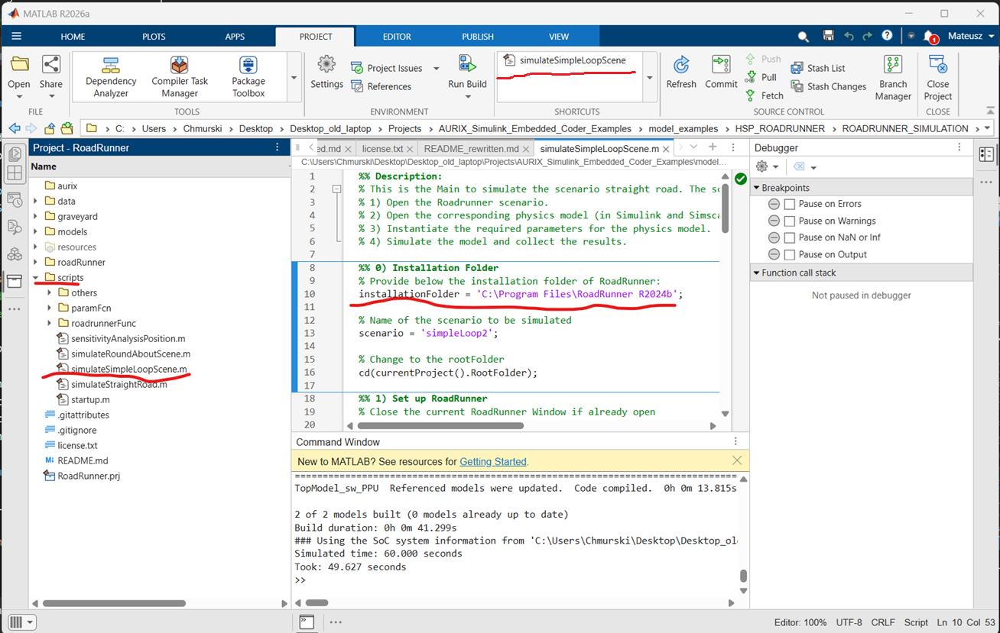
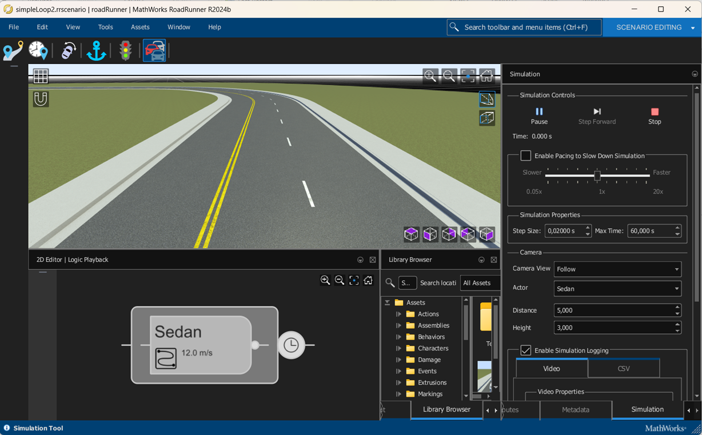
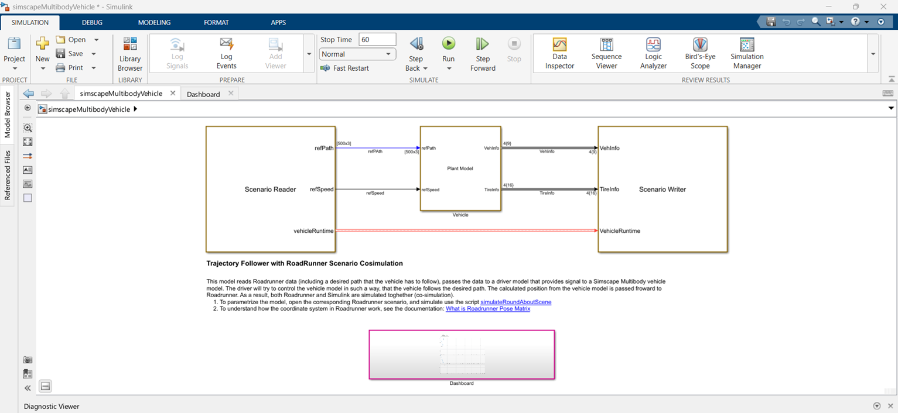
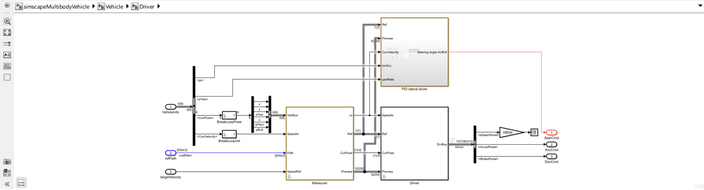

# Physics-based vehicle simulation with RoadRunner&trade; and Simscape Multibody&trade;

This project implements a closed-loop co-simulation between **MathWorks&reg; RoadRunner&trade;** and a **Simscape Multibody&trade;** vehicle model. RoadRunner&trade; provides the scene, scenario, and prescribed trajectory, while Simscape Multibody&trade; handles the physical dynamics of the vehicle.

---

## Table of Ccontents

- [Overview](#overview)
- [Prerequisites](#prerequisites)
- [Installation](#installation)
- [Project structure](#project-structure)
- [Running the demo](#running-the-demo)
- [Model architecture](#model-architecture)
  - [Co-simulation loop](#co-simulation-loop)
  - [Controller design](#controller-design)
  - [Vehicle plant model](#vehicle-plant-model)
- [Required products](#required-products)

---

## Overview

RoadRunner&trade; excels at defining realistic driving scenes and scenarios, but its actors follow prescribed trajectories without any physics-based constraints. This project bridges that gap by coupling RoadRunner with a **14 DOF Simscape Multibody vehicle model**:

1. RoadRunner&trade; sends the target trajectory and desired speed to Simulink&trade;.
2. The Simscape Multibody&trade; model simulates the physical vehicle response.
3. The resulting vehicle pose is fed back to RoadRunner&trade;, driving the visualization with real physics.

A short video walkthrough is available on LinkedIn: [Enhance RoadRunner with Physics-Based Vehicle](https://www.linkedin.com/posts/lorenzonicolettiphd_adas-roadrunner-simscape-activity-7414627533524004864-l2Nh?utm_source=share&utm_medium=member_desktop&rcm=ACoAABkndTkB2sEZc48vLhcPtTp-g-xzFhym0p0).

---

## Prerequisites

- MATLAB® R2026a or later
- A valid MathWorks account (for RoadRunner&trade; activation)
- All [required toolboxes](#required-products) installed

---

## Installation

### 1. Install RoadRunner&trade;

Download and install a version of RoadRunner&trade; that matches your MATLAB release:  
[Install and Activate RoadRunner&trade;](https://de.mathworks.com/help/roadrunner/ug/install-and-activate-roadrunner.html)

Sign in with your MathWorks account during activation.

### 2. Configure the MATLAB environment

Run the following in the MATLAB Command Window to configure the RoadRunner&trade; integration:

```matlab
roadrunnerSetup
```

---

## Project structure

```
ROADRUNNER_SIMULATION/
├── data/
│   ├── aurix/          - UDP interface headers
│   ├── controller/     - Pre-recorded data and trained networks
│   ├── images/         - Documentation screenshots
│   └── tires/          - Tire parameter files (.tir)
├── graveyard/
├── models/             - Simulink&trade; / Simscape&trade; models (.slx)
├── resources/
│   ├── project/
├── roadRunner/         - RoadRunner&trade; scene and scenario assets
├── scripts/            - MATLAB scripts for simulation and analysis
└── README.md
└── RoadRunner.prj      - your entry point
```

---

## Running the demo


After installing RoadRunner&trade; and configuring the environment, start the simulation by running:

```matlab
simulateSimpleLoopScene
```

Alternatively, the simulation can be launched from the **Shortcuts** tab by selecting **simulateSimpleLoopScene**, as shown in the figure below.

> **Note:** Ensure that the `roadrunnerInstallPath` variable in [`scripts/simulateSimpleLoopScene.m set to your local RoadRunner&trade; installation directory before running the simulation.



The script will automatically:

1. Launch RoadRunner&trade;
2. Load the scene from the [`roadRunner/`](roadRunner) folder
3. Open the Simscape&trade; Multibody&trade; vehicle model
4. Run the co-simulation

### Scenario

The simulated scenario features a vehicle navigating a **simple loop**.



---

## Model architecture

### Co-simulation loop

The top-level Simulink model ([`simscapeMultibodyVehicle`](data/images/simscape_model1.png)) consists of three functional blocks:

| Block | Role |
|---|---|
| **RoadRunner Reader** | Reads the prescribed trajectory (violet path) and target speed from RoadRunner |
| **Vehicle & Controller** | Simulates the physical vehicle dynamics and driver response |
| **RoadRunner Writer** | Computes the actual vehicle pose and sends it back to RoadRunner |



> **Important:** The RoadRunner Reader is implemented for the specific trajectory used in this demo. If you modify the scenario or add more complex behaviors, **you must update the RoadRunner Reader accordingly**.

For details on the RoadRunner coordinate system, see [RoadRunner Pose Matrix Documentation](https://de.mathworks.com/help/driving/ug/what-is-roadrunner-pose-matrix.html).

### Controller design

As illustrated in the figure below, the lateral control signal (i.e., the steering angle) is computed by the AURIX MCU, whereas the longitudinal control signals are generated by a simulated controller. The lateral control function can alternatively be implemented by a simulated controller, such as the Stanley controller, instead of the AURIX MCU.




## Required products

Developed and tested on **MATLAB&reg; R2026a**.

| Product | Role |
|---|---|
| MATLAB&reg; | Scripting and data processing |
| Simulink&reg; | Model-based simulation environment |
| Simscape&trade; | Physical modeling foundation |
| Simscape Multibody&trade; | 14 DOF vehicle dynamics model |
| Automated Driving Toolbox&trade; | RoadRunner integration |
| RoadRunner&trade; | Scene and scenario authoring |

---
