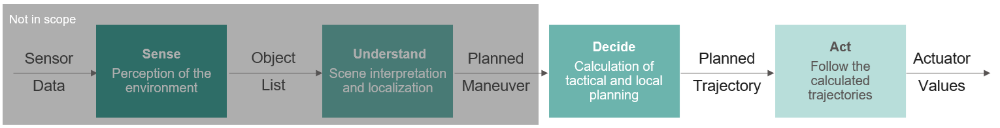
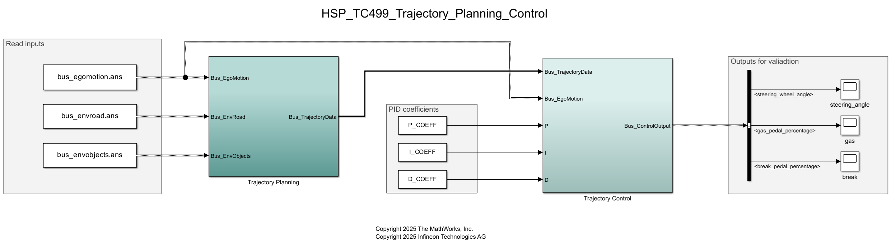
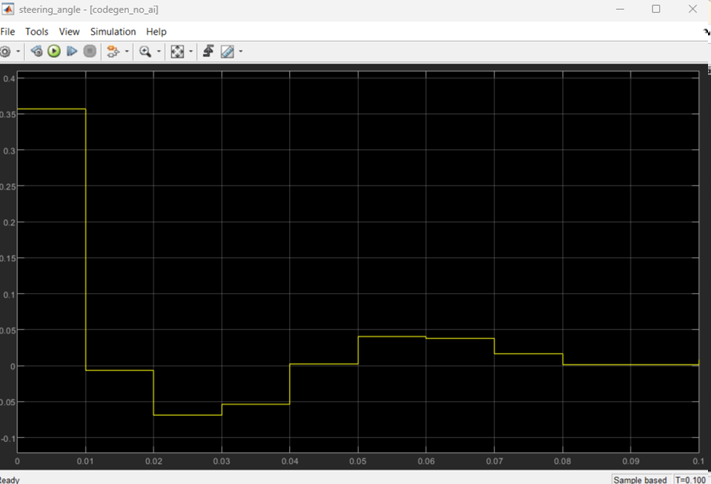
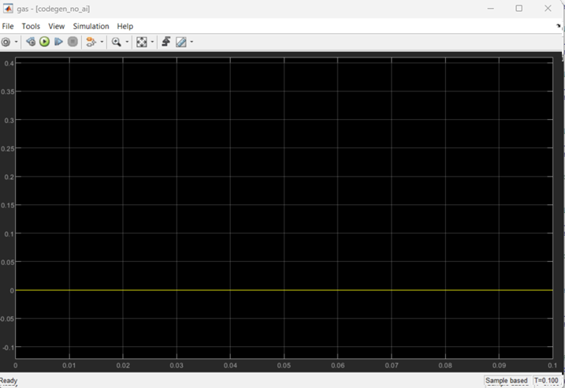
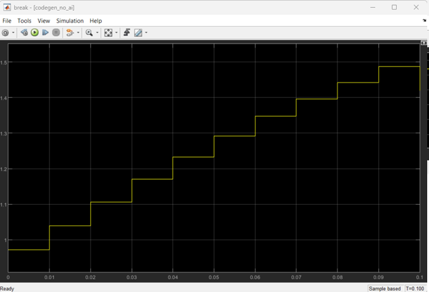

# HSP_TC499_Trajectory_Planning_Control

This example demonstrates algorithms for trajectory planning and control. In the autonomous driving stack, this covers the **Decide** and **Act** steps, while the environment perception and scene interpretation steps are out of scope of this demo.

Model Predictive Control (MPC) has emerged as a powerful optimization-based approach for trajectory planning in complex environments. By leveraging a predictive model of the vehicle dynamics, MPC enables the computation of optimal control inputs (trajectory) that minimize a performance criterion while satisfying constraints on system states and inputs. This method allows for the anticipation of future states of the vehicle and the environment, facilitating the adjustment of control commands in real-time to navigate dynamic scenarios effectively. 

In conjunction with MPC, Proportional-Integral-Derivative (PID) control is employed to refine the execution of the planned trajectory. The PID controller processes the desired trajectory points generated by the MPC and translates them into specific steering angles necessary for vehicle control. This feedback mechanism effectively minimizes the error between the actual vehicle path and the target trajectory, ensuring smooth and responsive steering adjustments. The combination of MPC and PID control thus provides a robust framework for achieving precise trajectory tracking in autonomous driving applications. 

 

## Prerequisites

### Software
* MathWorks' MATLAB R2025a
    - Hardware Support Package for AURIX&trade; TC4x
    - Embedded Coder Support Package for Infineon AURIX&trade; TC4x Microcontrollers

## Running the Example

### Simulation
1. Run the **initialize_project.m** script
2. Wait for the workspace to load and the Simulink model to open
3. Simulation starts automatically, and can be restarted from Simulink
4. (Optional) Open the scopes on the right side of the top model and compare them to the reference results bellow.

#### Reference results

Steering angle

Gas pedal

Break pedal

### Code Generation
1. With the Simulink model opened, navigate to **APPS** tab and open **Embedded Coder**
2. In the newly opened **C CODE** tab, click the **Generate Code** button
3. Wait for the code generation to finish, this could take several minutes. Code panel should open on the right side of your Simulink app. The generated code is also packaged in a zip file in the project folder.

